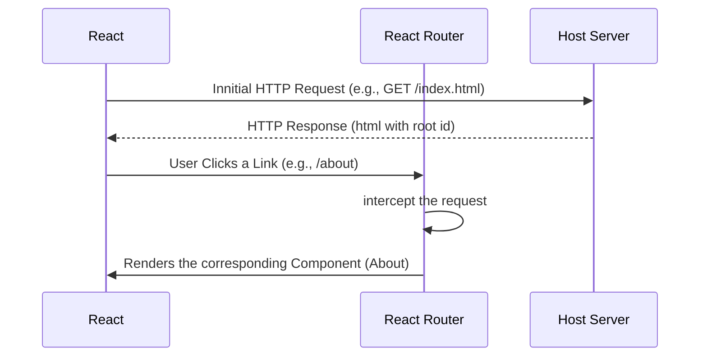

# Project 3: Spike 6

## React Router

[**React Router**](https://reactrouter.com/en/main/start/overview) is React's answer to "pages". React is a single page application, which means that it's really only a single `index.html` file which we then use JavaScript to fill dynamically. React Router lets you set "routes" that will render specific page components when that route is visited. This is known as **client-side routing**.



React Router is an additional package that we have to install:

```
npm install react-router-dom
```

We are installing `react-router-dom`, which holds all the functions and Components for routing within a web app. The full package `react-router` has both `react-router-dom` and `react-router-native`, which is for native apps.

## Browser Router

We will be using the **BrowserRouter**. There are several [routers](https://reactrouter.com/en/main/routers/picking-a-router) available, depending on the environment, but BrowserRouter is the recommended router for web projects. The first step is to [**create**](https://reactrouter.com/en/main/routers/create-browser-router) an instance of the router using `createBrowserRouter()`. This function will accept an array of objects - this is where you define your individual routes. The route object will need the `path` you intend for your route (ie. the URL), and the `element` (ie. the page Component you wish to be rendered when a user navigates to this route).

I'll need some Components to render, so I'll make a folder in the `src` called `pages` to hold all my page-level Components. You could also call it `views`, or `routes`. Something to indicate that these are the essentially the `<body>` of each page. If you've installed the **E7 React/Redux/React-Native snippets** extension, you can use **tsrfce** to boilerplate a Typescript React Functional Component with `export default`. To start, I'll just make a quick `<Homepage />` and an `<Error404 />`. Then, on my `main.tsx`, I'm going to create my router.

```ts
const router = createBrowserRouter([
  {
    path: "/",
    element: <Homepage />,
  },
  {
    path: "*",
    element: <Error404 />,
  },
]);
```

The path `"/"` represents your **index**. Alternatively, you can set `index: true` instead of a path. The path `"*"` acts like a catch-all for any route not defined. If you don't do this, and your user ends up on a route with no Component, then the default error message from React Router will display.

Now that we've defined a Router, we can assign it a **provider**. Import `RouterProvider` and pass it the router instance we created. You'll need to make sure your file extension is `.tsx`.

```tsx
ReactDOM.createRoot(document.getElementById("root")!).render(
  <React.StrictMode>
    <RouterProvider router={router} />
  </React.StrictMode>
);
```

You can create as many routes as you need for each page you would like to have, so let's build a navigation bar. This will also be slightly different to your static projects, because in React an `<a>` element causes a hard refresh on the page. We don't want that - it defeats the purpose of React's state management system! Luckily, React Router gives us some options. Let's create a folder in the `src` to hold our `components`, and create a file called `Navbar.tsx`. There are ways of using Layouts to do this more efficiently, but for now I'm just going to manually import the `<Navbar />` into each page I want it to be displayed.

```tsx
function NavBar() {
  const navContainerStyles = {
    width: "100%",
    height: "50px",
    border: "solid 1px black",
    display: "flex",
    gap: "1em",
    alignItems: "center",
    padding: "0 1em",
  };
  return <nav style={navContainerStyles}></nav>;
}
```

There is a pre-made `<Link>` component that we can import from "react-router-dom". This `<Link>` will accept a `to` props, which will be a string for whichever of our paths we intend to link to.

```js
<Link to="/">Home</Link>
<Link to="/about">About</Link>
```

## useLocation()

React Router Dom provides a few custom Hooks, `useLocation()` being one that provides information about the page. If we save this as a variable and log it to the console, we can have a look at it. The property `state` can be used to transfer some data through the `<Link>` component. Whatever is passed as state props, can then be accessed through `location.state` on the other end. Be aware though, that clicking the Link is necessary to trigger the transfer. If a user navigates to the page manually through the URL, or returns there with the back button, `state` will be `null`.

This location object also holds a property called `pathname`. We can use this to indicate to our user which page they're on in React. Since the same component can be rendered across multiple pages, the pathname shows you the current page URL. This is how we can write some conditional style or className attributes on our `<Link>` component. A nice clean way to do this is to use a **Ternary Operator**. Think of this as a shorter way of writing an **if.. else..** statement! The first 'statement' is the 'if' followed by a **question mark** ( **?** ), and the value to be supplied if that statement is _true_. This is then followed by a **colon** ( **:** ), and the value to be supplied if the initial statement is _false_.

```tsx
import { Link } from "react-router-dom";

function Navbar() {
  const path = useLocation().pathname;

  const activeLink = {
    color: "red",
    fontWeight: "bold",
  };
  return (
    <nav>
      <Link to="/" className={path === "/" ? "active" : ""}>
        Home
      </Link>
      <Link to="/about" style={path === "/characters" ? activeLink : {}}>
        About
      </Link>
    </nav>
  );
}
```

When using the Ternary Operator, pay attention to the Types of values you're passing. The `className` property will accept `string` or `undefined` values, while the `style` property is expecting an `object` or `undefined`.

Another way to achieve the same result is to use a different component supplied by React Router called `<NavLink>`, which has an active class without the need for `useLocation()`. The component adds the class "active" to the classlist by default if the pathname matches, so you can then just have to make sure you have a CSS class `.active`, and those styles will automatically apply.

If you're using CSS modules or `style` property, however this won't work. Luckily, the `className` or `style` property on a `<NavLink>` will also accept a function. This function receives a parameter `isActive`, which will be true or false according to the active state. Use this to set your styles.

```js
import { NavLink } from "react-router-dom";

function Navbar() {
  return (
    <nav>
      <NavLink
        className={({ isActive }) => (active ? "activeClass" : "")}
        to={"/"}
      >
        Home
      </NavLink>
      <NavLink
        style={({ isActive }) => (active ? activeStyle : {})}
        to={"/about"}
      >
        About
      </NavLink>
    </nav>
  );
}
```

## useNavigate()

React Router's `useNavigate()` [hook](https://reactrouter.com/en/main/hooks/use-navigate) can also be used to navigate between pages. Let's experiment by using the `useNavigate()` hook function component to create a back buttons from our Error page. Create a variable `navigate` to hold the return of the Hook. The first argument accepted by the `navigate()` function is the path. This will usually be a string, but you could also put `-1` to mimic the behaviour of the back button in the browser.

If you navigate to a `string` path, you can include an options object as a second argument: the `replace` property will accept a `boolean` to indicate whether the page should be replaced in the history stack (you might choose to use this when navigating after login or sign up), and the `state` property can be used the same way as with `useLocation()`.

```js
import { useNavigate } from "react-router-dom";

function Error404() {
  const navigate = useNavigate();
  return (
    <div>
      <h1>Error404</h1>
      <button onClick={() => navigate(-1)}>Back...</button>
      <button onClick={() => navigate("/", { replace: true })}>
        Go Home...
      </button>
    </div>
  );
}

export default Error404;
```

`<Navigate />` component exists to solve the problem of Hooks being unavailable in Class Components. It will take all the same arguments as props, and can be called in our return, like any other component. As soon as it renders, your user will be navigated.

```js
import { Navigate } from "react-router-dom";

function Error404() {
  return <Navigate to={"/"} replace={true} />;
}

export default Error404;
```

Older [documentation](https://reactrouter.com/en/v6.3.0/getting-started/overview) with `<BrowserRouter>`, `<Routes>` and `<Route>` components.
