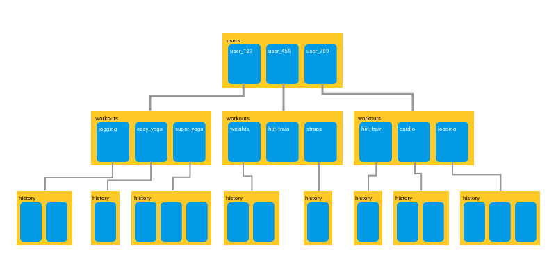

# Spike 18 notes

## Firebase Firestore (database)

- **Firestore** is one of two Firebase database options available. You may have read something about the **Firebase Realtime Database**, which offers much of the same functionality, with a different data structure. If you'd like to read about the differences, [here](https://firebase.blog/posts/2017/10/cloud-firestore-for-rtdb-developers) is a good article. We will only have time to cover one, so we're going to use Firestore.

- We'll follow the steps in Firestore's [Get started](https://firebase.google.com/docs/firestore/quickstart) documentation. 

- Start by clicking on **Create database**. We're going to be starting in **test mode**. You'll see in the code snippet, the test mode is set to expire after 3 months. It is possible to extend this indefinitely to keep your App functional, or you can establish security rules once you have your App deployed with a domain.

- The location determines which servers your data will be stored on. It's best to choose the location closest so where you are - so I'll select **eur3 (Europe)** then 'enable'. Firebase will create my database, and I should be redirected to the overview. Under the submenu **Rules**, you can update the code snippet to extend the duration of the test mode period. 

- We can now skip down to 'Initialize Cloud Firestore'. You'll maybe recognise this code snippet to represent our firebaseConfig.js. We'll need to copy and paste the new lines into our file. Make sure to also export the **db** variable, as we'll need to import and use this in other components. 

- The next step is to start adding data. Understanding the way Firebase stores data into **collections** and **documents** is crucial to make the most out of the database!

- The **yellow** represents a **collection**, and the **blue** represents a **document**. A collection holds multiple documents, but a collection can also be nested _inside_ a document! This is called a **sub-collection**. The page on [data modals](https://firebase.google.com/docs/firestore/data-model) in the documentation is definitely worth a read! 

- For now though, let's have a little play with the database UI. Create a collection, and then add a document. That document can now hold sub-collections, which can in turn hold _more_ documents, which can also hold sub-collections of their own, and so on! Now is the time to think about how you would like to structure your data. I recommend reading through the page for [adding data](https://firebase.google.com/docs/firestore/manage-data/add-data) in the docs (there is an important distinction between using **addDoc()** and **setDoc()**).

- I'm going to create an open chat page to demonstrate how to add documents to a collection on the top-most level. I'll create a new page, add a **Route** on the App.js, and add a **&lt;Link&gt;** to my NavBar. I will also make this a **Protected Route** so that only logged in users can visit this page. On this page I'll put an **&lt;h1&gt;** to indicate my location, a **&lt;div&gt;** to hold all the comments, and a second **&lt;form&gt;** for users to submit new comments.

- I'll need a state to hold the value of my **&lt;textarea&gt;**, which will need to have an **onChange** event set to a **handleChange** function, which sets the state to the target value. I'll also need a **handleSubmit** function. Log the state variable linked to the **&lt;textarea&gt;** value to test they're all connected.

- Now I want to create a **JavaScript Object** to be submitted as my document. The properties I want to include are the **author** of the comment (this will be the current user, just their **uid** will be enough to identify them), a **date** (the current date and time), and the **text** of the comment (the value of the text input). Log this object to the console to check what it looks like.

- Now that I'm satisfied with how my document is structured, I will add it to the database! The **setDoc()** method allows you to assign your document an ID, or name. Since I don't have any reason to do that and I'm happy to let Firestore assign it a unique ID on my behalf, I will use the **addDoc()** method. 

- My **addDoc()** method will take two arguments: a callback function called **collection()** (which will also need to be imported from 'firebase/firestore'), and the document to be added (my object variable). The **collection()** method in turn takes a minimum of two arguments: the **db** variable from our firebaseConfig.js file will always be the first. The next is the name of the collection we are adding our document to. If a collection by this name exists, the document will be added. If no collection by this name exists, a new one will be automatically created! 

- Add this function to the **handleSubmit** (I'll need to make it asynchronous). If we've set it all up correctly, we should have something logged to the console. We can now check our database - it will need to be refreshed to see the changes. We should have our first comment! 

- Adding more arguments to this function is how you will access sub-collections: the name of the parent document, then the name of the sub-collection will come next. 